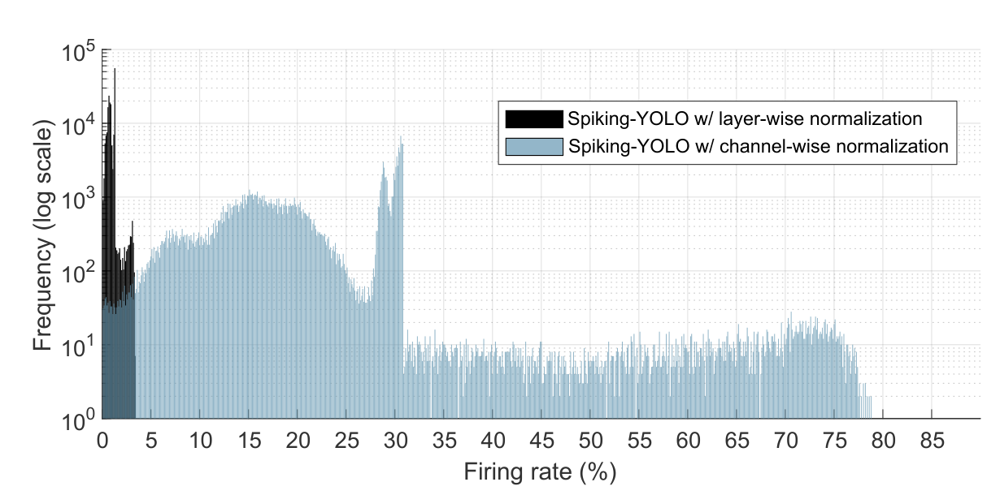
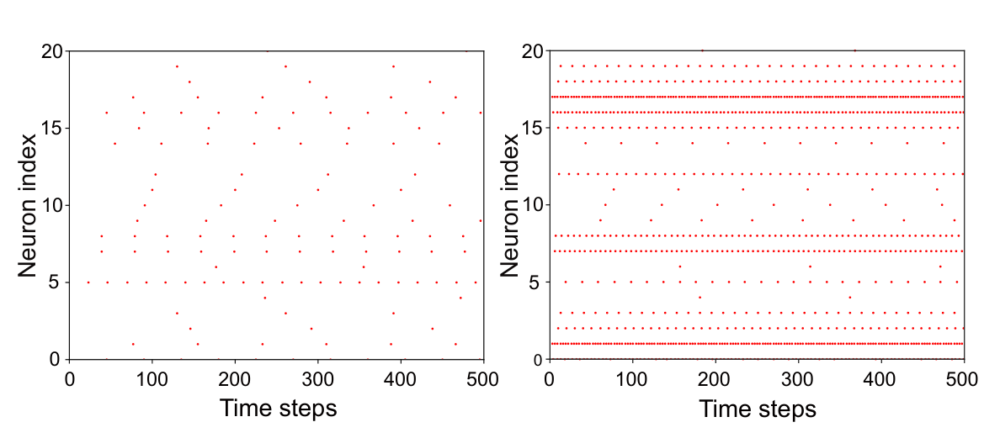

# Spiking-YOLO: Spiking Neural Network for Energy-Efficient Object Detection

# Abstract

DNN은 다양한 분야에서 괄목할 만한 성능을 입증

SNN은 3세대 신경망으로 관심을 끌었지만, 훈련하기 어려움

이 연구에서는 보다 까다로운 회귀 문제(물체 감지)에서 SNN의 성능 저하를 조사함. 심층 분석을 통해 채널별 정규화와 불균형 임계값을 가진 부호화된 뉴련이라는 두 가지 새로운 방법을 도입하여 심층 SNN에 빠르고 정확한 정보 전송을 제공함. 그 결과 Spike 기반 객체 ㄱ마지 모델인 Spiking-YOLO를 최초로 제시함. 실험 결과, Spiking-YOLO는 PASCAL VOC와 MS COCO에서 Tiny YLO와 비슷한 수준(최대 98%)의 놀라운 결과를 달성. 또한 뉴로모픽 칩의 Spiking-YOLO는 Tiny YOLO보다 약 280배 적은 에너지를 소비하며, 기존 SNN Conversion 방법 보다 2.3배에서 4배 빠르게 수렴함.

# Introduction

DNN이 성공할 수 있었던 이유 중 하나는 대량의 데이터 활용에 기인. 실제로 고급 문제를 해결하려면 더 정교한 모델과 학습 데이터가 필요. 이로인해 많은 컴퓨터 자원이 소모됨. 이러한 문제 극복을 위해 가지치기(Pruning)등을 이용해 에너지 효율적인 DNN을 설계하려고 시도해옴

SNN은 뛰어난 전력 효율성을 제공하고 뉴로모픽 아키텍쳐에서 선회되는 신경망이지만 비교적 단순한 작업과 작은 데이터 세트에만 제한적으로 사용되어 왔고 다소 얕은 구조를 기반으로 함. 

주된 이유는 스파이크 뉴런의 복잡한 역학과 차별화할 수 없는 연산으로 인해 확장 가능한 훈련 알고리즘이 부족하기 때문. 이로 인해 Conversion 방법이 광범위하게 연구되어 옴. 이러한 방법은 사전 학습된 매개변수(가중치 및 바이패스)를 DNN에서 SNN으로 가져오는 아이디어에 기반. DNN에서 SNN으로 변환하는 방법은 SNN에서 기존 DNN(VGG, ResNet)과 비슷한 결과를 얻었지만, MNIST 및 CIFAR 데이터 세트의 결과는 경쟁력이 있었지만 ImageNet 데이터 셋의 경우 만족스러운 결과를 얻기 어려웠음

==해당 연구에서는 DNN에서 SNN으로의 Conversion 방법을 사용하여 Deep SNN의 고급 ML 문제인 Object Detection에 대해 살펴봄==

객체 감지는 여러 개의 겹쳐진 물체를 인식하고 경계 상자의 정확한 좌표를 계산해야 하기 때문에 훨씬 더 까다로운 것으로 알려져 있음. 따라서 이미지 분류에서처럼 가장 높은 확률로 하나의 클래스(즉, 최대함수)를 선택하는 대신 신경망의 출력값을 예측하는 데 높은 수치 정밀도(즉, 회귀 문제)가 필요함. 심층 분석 결과 deep SNN에서 객체 감지를 적용할 때 몇 가지 문제가 발생함 

1. 기존 정규화 방법의 비효율성
2. SNN 영역에서의 Leaky-ReLU를 효율적으로 구현할 수 있는 방법이 없음

==이러한 문제를 극복하기 위해 채널별 정규화와 임게값이 균형 잡힌 부호화된 뉴런이라는 두 가지 새로운 방법을 도입함.==

**Structure of Tiny-YOLO**

그 결과 스파이크 기반 감지 모델인 Spiking-YOLO를 제시함. SNN에서 객체 감지를 위한 첫 번째 단계로 Tiny YOLO에 기반한 Spiking-YOLO를 제시함. SNN에서 객체 감지를 위한 첫 번째 단계로 저자는 Tiny YOLO에 기반한 Spiking-YOLO를 구현함. 저자에 따르면 이것은 사소하지 않은 데이터셋에서 DNN과 비슷한 결과를 얻은 최초의 객체 감지를 위한 deep SNN으로 PASCAL VOC, MS COCO에서 비슷한 결과를 얻음

*__PASCAL VOC:__ 'Pattern Analysis, Statistical Modeling and Computational Learning Visual Object Classes'의 약자. 이 데이터셋은 객체 인식, 객체 분할, 분류, 액션 인식 등 다양한 컴퓨터 비전 문제를 위해 사용됨.*

*__MS COCO:__ MS사에서 개발한 대규모 이미지 데이터셋으로 Common Objects in Context의 약자. 객체 인식, Segmentation, 캡셔닝 등의 다양한 비전 문제를 위해 설계됨. 일상 생활의 이미지를 다양하게 포함함.*

주요 Contribution

* **First object detection model in deep SNNs.** 위에서 언급된 데이터셋에서 기존 DNN과 비슷한 수준인 98%의 결과 달성
* **Channel-wise normalization.** deep SNN을 위한 세분화된 정규화 방법을 개발. 제안된 방법은 여러 뉴런에서 더 높으면서도 적절한 발화 속도를 가능하게 하여 deep SNN에서 빠르고 정확한 정보 전송을 가능하게 함
* **Signed neuron featuring imbalanced threshold.** SNN 도메인에서 정확하고 효율적인 Leaky-ReLU 구현 방법을 제안함. 제안한 방법은 최소한의 오버헤드로 뉴로모픽 칩에서 쉽게 구현 가능함

# Related Work

### DNN-to-SNN Conversion

**요약**

SNN은 스파이크를 사용, IF 뉴련의 원리. SNN은 이벤트 기반 특성으로 인해 에너지 효율적이지만 훈련하기 어려움

보통 STDP를 이용한 비지도 학습이나 경사 하강 및 오류 역전파를 사용한 지도 학습으로 훈련함. STDP가 생물학적으로 더 타당하지만 지도 학습에 비해 성능이 낮음

따라서 DNN-SNN Conversion 방법이 제안됨. 이러한 Conversion은 편향과 최대 풀링을 무시하는 방법부터 시작하여, 데이터 기반 정규화, 배치 정규화 및 스파이크 최대 풀링 구현, VGG 및 잔류 구조로의 확장에 이르기까지 발전

그러나 이러한 연구 대부분은 이미지 분류 작업과 MNIST 데이터셋에 국한되어 있음.

### Object Detection

**요약**

**객체 탐지의 정의.** 객체 탐지는 이미지나 비디오에서 하나 또는 여러 객체를 찾아내고 이를 바운딩 박스로 표시한 다음 그 클래스를 식별하는 과정.

객체 탐지 모델은 객체를 분류하는 분류기 뿐만 아니라 바운딩 박스에 정확한 좌표(x축 및 y축)와 크기(너비와 높이)를 예측하는 회귀기도 포함

바운딩 박스의 정확한 좌표를 예측하는 것이 중요하기 때문에 객체 탐지는 단순히 가장 높은 확률을 가진 클래스를 선택하는 이미지 분류보다 훨씬 더 도전적인 작업으로 간주됨

**지역 기반 CNN(Region-based CNN, R-CNN).** R-CNN은 객체 탐지에서 가장 중요한 진전 중 하나로 여거짐. 탐지 성능과 속도를 향상시키기 위해 R-CNN의 여러 확장 버전의 제안됨. 이에는 Fast R-CNN, Faster R-CNN, Mask R-CNN 등이 있음

그러나 R-CNN 기반 네트워크는 여러 단계의 탐지 방식으로 인해 추론 속도가 느리며 실시간 객체 탐지에는 적합하지 않음

**단일 단계 탐지 방법(one-stage detection).** 바운딩 박스 정보를 추출하고 객체를 분류하는 통합 네트워크에서 수행되는 단일 단계 탐지 방법이 제안됨. 단일 단계 탐지 모델에서는 "Single-shot multi-box detector(SSD)"와 "You only look once(YOLO)"가 최신 기술을 달성

특히 YOLO는 정확도의 중대한 손실 없이 우수한 추론 속도(Inference Speed, FPS)를 보여주며, 이는 실시간 객체 탐지에서 중요한 요소임

따라서 Tiny YOLO가 객체 탐지 모델로 선택됨

# Methods

==객체 탐지에서 여러 객체를 인식하고 그 주위에 경계 상자를 그리는 것(즉, 회귀 문제)은 네트워크의 출력 값을 예측하기 위해 높은 수치 정밀도가 필요하다는 큰 과제를 안고 있습니다. 기존의 DNN에서 SNN으로의 변환 방법을 사용하여 딥 SNN에 객체 검출을 적용하면 심각한 성능 저하가 발생하여 객체를 감지할 수 없음.== 심층 분석 결과, 이러한 성능 저하의 원인으로 1. 수많은 뉴런에서 매우 낮은 발화속도 2. SNN에서 Leaky-ReLU의 효율적인 구현 방법의 부재를 꼬븡ㄹ 수 있음. 이러한 문제점을 극복하기 위해 두 가지 새로운 방법을 제안

이는 불균형한 임계값을 가진 부호화된 뉴런임

## Channel-wise data-based normalization

### Conventional normalization methods

==일반적인 SNN에서는 뉴런이 입력의 크기에 따라 스파이크 열을 생성하고 이러한 스파이크 열을 정보 손실 없이 전송하는 것이 중요함. 그러나 정해진 시간 단계가 주어졌을 때 뉴런의 과활성화 또는  저활성화로 인해 정보 손실이 발생할 수 있음.== 예를 들어 임계전압 Vth가 매우 크거나 입력이 작으면 막전위 Vmem이 Vth에 도달하는 데 오랜 시간이 걸려 낮은 발화율(즉, 저활성화)를 초래함. 반대로 Vth가 매우 작거나 입력이 크면 Vmem은 대부분 Vth를 초과하고 뉴런은 입력값에 관계없이 스파이크를 생성하게 됨.(즉, 과활성화). 발화율은 주어진 시간 단계 T에서 스파이크의 총 수 N으로 정의될 수 있으며, 최대 발화율은 매 시간 단계마다 스파이크가 생성될 수 있기 때문에 100%가 됨

==뉴런의 과활성화나 저활성화를 방지하기 위해 가중치와 임계 전압은 뉴런의 충분하고 균형 잡힌 활성화를 위해 신중하게 선택되어야 함. 따라서 다양한 데이터 기반 정규화 방법들이 제안됨.== 레이어별 정규화(Layer-wise normalization, Layer-norm)은 가장 잘 알려진 정규화 방법 중 하나임. Layer-norm은 DNN에서 훈련 데이터셋을 실행하여 해당 층의 최대 활성화를 사용하여 특정 층의 가중치를 정규화함. 이는 훈련 및 테스트 데이터셋의 분포가 유사하다는 가정에 기반함. 또한, 최대 활성화를 사용하여 가중치를 정규화하는 것은 출력 활성화를 정규화 하는 것과 동일한 효과를 가짐. layer-norm은 다음과 같이 계산됨.

여기서  *w*, *λ*, *b*는 각각 층 *l*에서의 가중치, 훈련 데이터셋에서 계산된 최대 활성화, 편향임.  Layer-norm의 확장 버전으로 최대 활성화의 99.9번째 백분위수를 사용하여 활성화를 정규화하는 접근 방식을 도입하여 이상치에 대한 견고성(Robustness)을 높이고 뉴런의 충분한 발화를 보장함. 그러나, ==저자의 실험에 의하면 전통적인 정규화 방법을 사용하여 deep SNN에 객체 탐지를 적용하면 모델은 상당한 성능 저하를 겪음==

**그림 1:** Tiny-YOLO에서 8개의 컨볼루션 레이어에 대해 각 채널에서 레이어별 정규화를 통해 최대 활성화를 정규화 했음. 파란색과 빨간색 선은 평균을 나타냄. 

### Analysis of layer-norm limitation

그림 1은  layer-norm에서 얻은 각 채너르이 정규화된 최대 활성화 값을 나타냄. Tiny YOLO는 총 8개의 합성곱 층으로 구성되어 있으며, x축은 채널 인덱스를 나타내고 y축은 정규화된 최대 활성화 값을 나타냄. 파란색과 빨간색 선은 각 층에서 정규화된 활성화의 평균 및 최소 값을 나타냄. 그림 1에서 강조된 바와 같이 ==특정 합성곱 층에서 각 채널의 정규화된 활성화의 편차가 상대적으로 큼.== 예를 들어 Conv1 층에서는 일부채널 (채널 6,7,14)의 정규화된 최대 활성화가 1에 가깝고 다른 채널(채널 1,2,3,13,16)에서는 0임. 다른 합성곱 층에 대해서도 마찬가지임. ==다시말해, layer-norm은 정규화 이전에 상대적으로 작은 활성화 값을 가진 수많은 채널에서 매우 작은 정규화된 활성화 (즉, 저활성화)를 초래함==

이러한 극도로 작은 정규화된 활성화는 이미지 분류에서는 감지되지 않았지만, ==깊은 SNN에서 회귀 문제를 해결하는 데 매우 문제가 될 수 있음.== 예를 들어 0.7을 전송하기 위해서는 7개의 스파이크와 10개의 시간 단계가 필요함. 동일한 논리를 적용하면 0.007을 전송하기 위해서는 정보 손실 없이 7개의 스파이크와 1000개의 시간 단계가 필요함. 따라서 매우 작은 값(예:0.007)이나 정밀한 값(예:0.9007 vs 0.9000)을 정보 손실 없이 전송하려면 많은 수의 시간 단계가 필요함. 시간 단계의 수는 전송되는 정보의 해상도로 간주됨. ==결과적으로 극도로 작은 정규화된 활성화는 낮은 발화율을 초래하며 필요한 것보다 시간 단계가 적을 때 정보 손실이 발생함.==

**그림 2:** 제안된 Channel-wise normalization; alj 는 layer l에서의 jth의 활성화 매트릭스임(feature map) 

### Proposed Normalization method

deep SNN에서 빠르고 효율적이 정보 전송을 위해 채널별 정규화(channel-norm)이라는 보다 세분화된 정규화 방법을 제안함. 이 방법은 기존의 레이어별 방식이 아닌 채널별 상식으로 가능한 최대 활성화(99.9%, 백분위수)로 가중치를 정규화함. 제안된 channel-norm은 다음과 같이 표현할 수 있음

여기서 i와 j는 채널의 인덱스임. layer l의 가중치 w는 각 채널에서의 최대 활성화 *λ**l**j*로 정규화됨(출력 활성화를 정규화 하는 것과 동일한 효과) 최대 활성화는 훈련 데이터셋에서 계산됨. 다음 layer에서 정규화된 활성화는 원래의 활성화를 얻기 위해 **λ**l*−1*i로 곱해져야함. 자세한 방법은 알고리즘 1과 그림2에 설명되어 있음

*이 알고리즘은 크게 두 부분으로 나뉜다. 첫 번째 부분은 훈련 데이터셋에서 각 채널의 최대 활성화(람다)를 계산하는 과정이고, 두 번째 부분은 추론(테스트 데이터셋)에서 채널별 정규화를 적용하는 과정이다.*

* 각 출력 채널(j)에 대한 활성화 행렬(A)에서 최대값을 찾아 람다lj 로 설정함. 여기서 Alj는 layer l의 채널 j에서의 활성화 값들을 포함하는 행렬임. 이 작업은 신경망의 모든 layer내의 모든 출력 채널에 대해 반복됨
* 각 layer에 대해 반복 -> 각 출력 채널에 대해 반복 -> 각 출력 채널의 bias(blj)를 해당 채널의 최대 활성화(람다lj)로 나눠 정규화된 바이어스(~blj)를 계산함 -> 각 입력 채널에 대해 반복 -> 첫번째 층인 경우, 만약 현재 층이 첫 번째 층이라면 각 가중치(wlij)를 해당 출력 채널의 최대 활성화(람다lj)로 나눠 정규화된 가중치(~wlij)를 계산함 -> 그 외의 층인 경우, 각 가중치(wlij)를 해당 출력 채널의 최대 활성화(람다ij)와 이전 층의 해당 입력 채널의 최대 활성화(람다l-1j)로 나눠 정규화된 가중치를 계산함

==채널별 방식으로 활성화를 정규화하면 정규화 이전에 작은 활성화 값(즉, 저활성화)을 가졌던 매우 작은 활성화가 제거된다. 다시말해 뉴런은 더 높지만 적절한 발화율을 얻도록 정규화되어, 짧은 시간 내에 정확한 정보 전송이 이루어진다.==

**그림 3:** Conv1 레이어의 채널 2에서 layer-norm과 channel-norm의 발화율 분포 비교

### Analysis of the improved firing rate

그림 3에서 x축과 y축은 각각 발화율과 로그 스케일에서 특정 발화율을 생성하는 뉴런의 수를 나타낸다. channel-norm의 경우 많은 뉴런들이 최대 80%까지 발화율을 생성했다. 하지만 layer-norm에서는 대부분의 뉴런이 0~3.5% 사이의 범위에서 발화율을 생성했다. 이는 channel-norm이 매우 작은 활성화를 제거하고 더 많은 뉴런이 더 높지만 적절한 발화율을 생성한다는 명확한 징후이다. 

**그림 4:** Tiny YOLO의 Conv1 Layer에서 16개 채널의 Layer-norm 및 channel-norm에 대한 발화속도

또한 그림 4는 합성곱 층 1의 각 채널에서 발화율을 보여준다. 확실히 channel-norm은 대부분의 채널에서 훨씬 높은 발화율을 생성한다. 특히 channel2에서 channel-norm은 layer-norm보다 20배 높은 발화율을 생성한다. 

**그림 5:** 샘플링된 20개의 뉴런 스파이크 활동의 Raster Plot, 왼쪽이 Layer-norm 이고 오른쪽이 Channel-norm이다.

더 나아가, 그림 5는 20개의 샘플링된 뉴런에서의 스파이크 활동 레스터 플롯을 보여준다. channel-norm이 적용될 때 많은 뉴런들이 더 규칙적으로 발화하는 것을 볼 수 있다.

저자의 자세한 분석은 세밀한 channel-norm이 활성화를 더 잘 정규화하고 낮은 발화율로 이어지는 불충분한 활성화를 방지한다는 것을 확인한다. 다시 말해, 매우 작은 활성화는 적절하게 정규화되어 뉴런이 짧은 시간 내에 정보를 정확하게 전송할 수 있다. 이러한 작은 활성화는 이미지 분류와 같은 단순한 응용에서 중요하지 않고 최종 네트워크 출력에 큰 영향을 미치지 않을 수 있지만, 회귀 문제에서는 중요하며 모델의 정확도에 큰 영향을 미친다. 따라서, channel-norm은 deep SNN에서 더 진보된 머신 러닝 문제를 해결하는데 유용한 해결책이라고 저자는 말한다.

### Signed neuron featuring imbalanced threshold

#### Limitation of leaky-ReLU implementation in SNNs

ReLU는 가장 일반적으로 사용되는 활성화 함수 중 하나로, 양의 입력 값만 유지하고 모든 음의 값을 버린다. 즉 f(x)=x (x>=0일 때) 그렇지 않으면 f(x)=0이다. ReLU와 달리 Leaky-ReLU는 알파의 기울기를 갖는 Leaky 항을 포함하여 음의 값을 포함한다. 이 기울기는 일반적으로 0.01로 설정된다.

이전의 대부분의 DNN-SNN Conversion 방법들은 음수 영역의 누설 항을 완전히 무시하고 ReLU를 Integrate-and-fire 뉴런으로 변환하는데 중점을 두었다. 이 때 Tiny YOLO에서 음의 활성화가 51% 이상을 차지한다는 점을 유의해야 한다. SNN에서 활성화 함수 범위를 음의 영역으로 확장하기 위해 두 번째 Vth 항(-1)을 추가한 이전 사례가 있다. 이들의 방법은 CIFAR-10에서 BinaryNet 활성화를 +1 또는 -1로 제한한 BinaryNet을 SNN으로 성공적으로 변환했다.

현재, 다양한 DNN은 활성화 함수로 Leaky-ReLU를 사용하지만 SNN 영역에서 Leaky-ReLU를 정확하고 효율적으로 구현하는 방법은 제안되지 않았다. Leaky-ReLU는 SNN에서 음의 활성화에 기울기 알파를 곱하는 것과 추가적인 Vth항 (-1)을 적용함으로써 구현될 수 있다. 그러나 이는 생물학적으로 타당하지 않으먀(스파이크는 이산 신호), Neuromorphic 칩에 적용할 때 상당한 도전이 될 수 있다. 예를 들어 기울기 알파의 부동 소수점 곱셈을 위한 추가 하드웨어가 필요할 것이다.

**그림 6:** imbalanced threshold를 특징으로 하는 제안된 signed neuron의 개요; Spiking Neuron을 위한 두개의 가능한 사례임

#### The notion of imbalanced threshold

저자는 양의 활성화와 음의 활성화를 모두 해석할 수 있을 뿐만 아니라 Leaky-ReLU의 음의 영역에서 누설 항을 정확하고 효율적으로 보상할 수 있는 불균형 임계값을 가진 부호화 뉴런(Signed neuron featuring imbalanced threshold, IBT)를 소개함. 제안된 방법은 음의 영역에 대한 다른 임계 전압 Vth,neg를 도입함으로써 스파이크의 이산 특성을 유지함. 두 번째 임계 전압 Vth,neg는 기울기의 음수 -a로 Vth를 나눈 값과 같으며, Vth,pos는 이전과 같이 Vth와 같음. 이는 Leaky-ReLU의 음의 영역에서 누설 항(기울기 a)를 복제함. IBT를 가진 부호화 뉴런의 기본 동역학은 다음과 같이 표현

그림 6에 나와 있듯이, 만약 기울기 a=0.1 이라면 양의 활성화에 대한 임계값 전압 Vth,pos는 1V이고 음의 활성화에 대한 임계 전압 Vth,neg는 -10V임. 따라서 Vmem은 Leaky-ReLU에서 음의 활성화 및 스파이크 생성을 위해 10배 더 많이 통합되어야 함.

또한 부호화 뉴런은 흥분성 및 억제성 뉴런의 구현을 가능하게 하며, 이는 더 생물학적으로 타당함. IBT를 사용한 부호화 뉴런을 사용하면 SNN에서 Leaky-ReLU를 정확하게 구현할 수 있으며, 최소한의 오버헤드로 현재의 Neuromorphic 아키텍처에 직접 매핑될 수 있음. 또한, 제안된 방법은 다양한 DNN 모델을 다양한 응용 분야에서 SNN으로 변환하는 데 더 많은 기회를 줄 것이라고 저자는 보고 있음.

# Evaluation

### Experiment setup

deep SNN에서 객체 탐지를 향한 첫 단계로 저자는 실시간 객체 탐지 모델인 Tiny YOLO를 사용했다. 이는 YOLO의 간단하지만 효율적인 버전이다. 저자는 이전 연구에 따라 SNN에서 max-pooling과 batch-normalization을 구현했다. Tiny YOLO는 사소하지 않은 데이터셋인 PASCAL VOC와 MS COCO에서 테스트 되었다. 시뮬레이션은 텐서플로우 Eager를 기반으로 하며, 모든 실험은 Nvidia Tesla V100 GPU에서 수행되었다.

**그림 7:** 다양한 구성(정규화 방법 + 부호화된 뉴런 + IBT + 디코딩 방식)에 대한 PASCAL VOC(왼쪽) 및 MS COCO(오른쪽)의 Spiking-YOLO 실험 결과, 최대 mAP는 괄호 안에 있다. 

### Experiment results

#### Spiking-YOLO detection result

제안된 방법의 기능을 검증하고 분석하기 위해 Channel-norm과 IBT를 가진 부호화 뉴런의 존재 유무의 효과를 조사하였다. 그림 7에서 보여지듯이, channel-norm과 IBT를 가진 부호화 뉴런이 모두 적용될 때 Spiking-YOLO는 VOC PASCAL에서 51.83%와 MS COCO에서 25.66%의 성능을 달성했다. Tiny YOLO의 목표 mAP는 53.01%(PASCAL VOC)와 26.24%(MS COCO)이다. 실제로 channel-norm은 객체 탐지에서 layer-norm을 큰 폭으로 능가하며, 특히 PASCAL VOC에서 더 빠르게 수렴한다(53.01% vs 48.94%). 예를 들어 Layer-norm의 chleo mAP(48.94)에 도달하기 위해 channel-norm은 약 3,500개의 시간 단계만 필요하다.(2.3배 더 빠름) MS COCO에서도 비슷한 결과가 관찰되며, channel-norm은 layer-norm보다 더 빠르게 수렴한다.(4배 더 빠름) 더 자세한 결과는 표1에서 확인할 수 있다.

제안된 방법 없이는 모델이 객체를 탐지하는데 실패하여 VOC PASCAL에서 6.87%, MS COCO에서 2.82%를 나타내었다. channel-norm이 적용되었을 때도 모델은 여전히 객체를 탐지하는 데 어려움을 겪으며, 최고의 경우 약 7.31%와 3.02%를 나타내었다. 이는 IBT를 가진 부호화 뉴런이 Leaky-ReLU의 음의 영역에서 누설 항을 정확하게 구현한다는 중요한 징우이다. 따라서 나머지 실험은 IBT를 가진 부호화 뉴런을 기본값으로 사용하여 수행되었다.

추가 분석을 위해 누적된 Vmem을 기반으로 한 출력 디코딩 방식과 스파이크 수를 기반으로 한 다른 방식에 대한 추가 실험을 수행했다. Vmem/Vth의 비율은 스파이크 수를 나타내며, 나머지는 반올림 된다. 이 나머지는 결국 오류가 되어 손실된다. 따라서 Vmem 기반의 출력 디코딩 방식은 스파이크 열을 해석하는데 더 정확하다. 그림 7이 이 주장을 확인한다. Vmem 기반의 출력 디코딩 방식은 스파이크 수 기반 방식보다 더 나은 성능을 보이며 channel-norm에서 더 빠르게 수렴한다.

**그림 8:** 객체 탐지 결과(Tiny YOLO vs Spiking-YOLO with layer-norm vs. Spiking-YOLO with channel-norm)

그림 8은 시간 단계가 증가함에 따라 Spiking-YOLO가 객체를 탐지하는 효과를 보여준다. 각 예시에서 가장 왼쪽 이미지(TIny YOLO)는 Spiking-YOLO가 복제하려는 ground truth label을 보여준다. 상단 왼쪽 예시(세 척의 배)에서 단지 1000개의 time step후에 channel-norm을 적용한 spiking YOLO는 세 개의 객체를 모두 성공적으로 탐지하였다. 한편 Layer-norm을 적용한 Spiking-YOLO는 어떤 객체도 탐지하지 못했다. 2000 Time step 후에는 객체 주위에 경계 상자를 그리기 시작하지만 하나의 객체에 여러 개의 경계 상자가 그려지고 크기가 모두 부정확하다. 탐지 성능은 시간 단계가 증가함에 따라 개선되지만 여전히 만족스럽지는 않다. 제안된 channel-norm의 탐지 성능에 도달하기 위해서는 5000 time step이 필요하다. 다른 예시를 참고하면 알 수 있듯이 제안된 Channel-norm이 더 짧은 시간 안에 다수의 미세한 객체를 정확하게 탐지하는 데 명확한 이점을 보여준다고 볼 수 있다.

#### Spiking-YOLO enregy efficiency

Spiking-YOLO의 에너지 효율성을 조사하기 위해 두 가지 다른 접근 방식을 고려함. 1. 디지털 신호 처리에서 Spiking-YOLO와 Tiny YOLO의 연산작업 2. Neuromorphic 칩에서의 Spiking-YOLO 대비 GPU에서의 Tiny-YOLO

첫번째로, DNN에서 대부분의 연산은 곱하기-누적(Multiply-accumulate)연산이 주로 수행되는 합성곱 층에서 발생한다. 그러나 SNN에서는 스파이크 이벤트가 이진 연산이므로, 스파이크가 수신될 때만 입력이 막 전위에 통합(또는 누적)되어 AC(accumulate)연산이 수행된다. 공정한 비교를 위해, 단일 이미지에서 객체 탐지를 수행하는 데 사용되는 연산 파워(MAC 및 AC)에만 초점을 맞추었다. 이전 연구에 따름녀 32비트 부동 소수점(Floating-point) MAC 연산은 4.6pJ(0.9+3.7)를 소모하고 AC 연산은 0.9 pJ를 소모한다. 32비트 정수(INT) MAC 연산은 3.2 pJ(0.1+3.1pJ)를 소모하고 AC 연산은 0.1pJ를 소모한다. 이러한 측정을 바탕으로 Tiny-YOLO와 Spiking-YOLO의 에너지 소비량을 FLOPs(부동소수점 연산)와 MAC 및 AC 연산의 에너지 소비량을 곱하여 계산했다. Tiny YOLO의 FLOPs는 이전 연구에서 보고되었고 Spiking-YOLO의 FLOPs는 저자의 시뮬레이션 중 계산되었다. 

**그림 9:** MAC 및 AC 연산을 위한 Tiny-YOLO와 Spiking-YOLO의 에너지 비교; 32비트 FL(왼쪽) 및 32비트 INT(오른쪽)

그림 9에서는 정규화 방법에 관계 없이 Spiking-YOLO가 32비트 FL 및 INT 연산에서 Tiny YOLO보다 2000배 이상 뛰어난 에너지 효율성 보여주는 것을 보여준다.

둘째로, Neuromorphic 칩에서의 SNN은 우수한 에너지 효율성을 제공하며 이는 신경망의 중요하고 바람직한 측면이라고 볼 수 있다. 저자는 최신 GPU(Titan V100)과 Neuromorphic chip(TrueNorth)에서 각각 실행된 Tiny YOLO와 Spiking-YOLO의 에너지 소비량을 비교했다. Titan V100의 전력과 GFLOPS(Giga floating-point operation per second)는 엔비디아에서 얻었고 TrueNorth의 GFLOPS/W는 이전 연구에서 보고된 것을 사용했다. 저자는 한 시간 단계를 1ms(1kHz 동기화 신호, 이전 연구 값을 동일하게 사용)로 정의했다.

**표 2:** Tiny-YOLO(GPU)와 Spiking-YOLO(Neuromorphic chips)의 에너지 비교

표 2에 나타난 계산에 따르면 TrueNorth에서 실행될 떄 Spiking-YOLO는 Tiny YOLO보다 약 280배 적은 에너지를 소비한다. 실험 결과에서 언급된 바와 같이, 제안된 Channel-norm은 layer-norm보다 훨씬 빠르게 수렴한다. 따라서 channel-norm을 사용한 Spiking-YOLO의 에너지 소비량은 비슷한 전력 소비량을 가진 Layer-norm의 에너지 소비량의 약 4배 더 적다. 현대 GPU가 훨씬 더 진보된 컴퓨팅 기술이며 TrueNorth 칩은 2014년에 처음 소개되었다는 점에 유의해야 한다. Neuromorphic chip이 계속 발전하고 성능이 향상됨에 따라 더 높은 에너지 및 컴퓨팅 효율성을 기대할 수 있다.

# Conclusion

본 논문에서는 사소하지 않은 데이터셋인 PASCAL VOC와 MS COCO에서 기존 DNN과 유사한 결과를 얻어 객체 탐지를 성공적으로 수행한 최초의 SNN 모델인 Spiking-YOLO를 소개했다. 이를 위해 두 가지 새로운 방법을 제안하였고 deep SNN에서 보다 발전된 문제를 해결하기 위한 첫 걸음이라고 저자는 이야기 한다.

